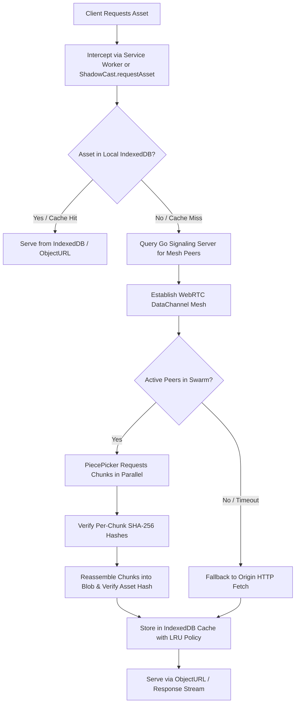

# ShadowCast ⚡

**A decentralized, client-side P2P mesh network engine that mirrors and streams static web assets directly browser-to-browser using WebRTC DataChannels.**

ShadowCast turns every website visitor into a caching edge node, drastically reducing origin server bandwidth, hosting costs, and latency for static assets (images, videos, WebAssembly binaries, 3D models, JS bundles, etc.).

---

## 🚀 Key Features

- ⚡ **WebRTC DataChannels Mesh**: Direct browser-to-browser asset streaming with deterministic glare-free peer negotiation.
- 📦 **Multi-Peer Swarm Piece Picker**: Torrent-style parallel chunk distribution across connected peers with mid-transfer failover and deduplication.
- 🔒 **Cryptographic SHA-256 Integrity**: Web Crypto SHA-256 validation on individual chunks and reassembled blobs to prevent data tampering.
- 🛠️ **Service Worker Fetch Interception**: Zero-code integration option that transparently intercepts standard `fetch()` and `` requests without touching application code.
- 💾 **Persistent IndexedDB Cache**: Cross-session storage engine featuring automatic LRU memory bounds (e.g. 250 MB max), entry limits, and TTL expiration.
- 📊 **Real-Time Telemetry & Event System**: Live typed events tracking peer joins/leaves, bandwidth saved, transfer sources (`p2p` vs `http` vs `cache`), and latency.
- 🛡️ **Hardened Go Signaling Backend**: Token-bucket rate limiting, Prometheus metrics (`/metrics`), health checks (`/healthz`, `/ready`), read limits, and graceful shutdown.
- 🌐 **NAT Traversal & TURN Relay**: Integrated `coturn` support in Docker Compose for symmetric NAT traversal.

---

## 🏛️ Architecture



---

## 📦 Installation & Usage

### 1. Install via npm

```bash
npm install shadowcast
```

### 2. Programmatic API Usage

```typescript
import { ShadowCast } from 'shadowcast';

// Initialize client
const sc = new ShadowCast({
  signalingUrl: 'ws://localhost:8080/ws',
  cache: {
    driver: 'indexeddb',
    maxSizeBytes: 250 * 1024 * 1024, // 250 MB
  },
  verifyIntegrity: true,
});

// Connect to a swarm room
await sc.connect('my-media-room');

// Listen to real-time events
sc.on('peer:join', ({ totalPeers }) => console.log(`Active peers: ${totalPeers}`));
sc.on('bandwidth:saved', ({ cumulativeBytes }) => console.log(`Bandwidth saved: ${cumulativeBytes} B`));
sc.on('transfer:complete', ({ url, source, durationMs }) => {
  console.log(`Resolved ${url} via ${source} in ${durationMs}ms`);
});

// Request an asset (automatically resolved via P2P swarm, cache, or HTTP fallback)
const blobUrl = await sc.requestAsset('https://example.com/assets/high-res-hero.jpg');
document.getElementById('hero-img').src = blobUrl;
```

### 3. Transparent Service Worker Interception (Zero-Code)

```typescript
// Register the transparent Service Worker
await sc.registerServiceWorker('/sw.js');

// Now, standard fetch() and  calls are automatically routed through P2P!
```

---

## 🏃 Quickstart (Docker Compose)

Start the signaling server, coturn TURN relay, and interactive Next.js visualization dashboard with one command:

```bash
git clone https://github.com/assishmoncs/shadowcast.git
cd shadowcast

docker compose up --build
```

- **Dashboard**: `http://localhost:3000`
- **Interactive Playground**: `http://localhost:3000/playground`
- **Signaling WebSocket**: `ws://localhost:8080/ws`
- **Signaling Health**: `http://localhost:8080/ready`
- **Prometheus Metrics**: `http://localhost:8080/metrics`

---

## 🧪 Testing

Run the comprehensive unit and integration test suite:

```bash
cd library
npm test
```

---

## 📁 Repository Structure

```
shadowcast/
├── library/               # Core TypeScript P2P WebRTC engine (npm package)
│   ├── src/
│   │   ├── core/          # Facade orchestrator, events, and types
│   │   ├── cache/         # IndexedDB, Memory cache, and LRU policy
│   │   ├── mesh/          # WebRTC PeerConnection and MeshManager
│   │   ├── transfer/      # ChunkSender, ChunkReceiver, and PiecePicker
│   │   ├── signaling/     # WebSocket SignalingClient
│   │   ├── interception/  # ServiceWorker script and manager
│   │   └── utils/         # SHA-256 Web Crypto hashing and URL utilities
│   └── src/__tests__/     # Unit & integration test suites
├── signaling/             # Production Go WebSocket signaling server
│   ├── main.go            # WebSocket routing, connection lifecycle, graceful shutdown
│   ├── config.go          # Centralized environment configuration
│   ├── ratelimit.go       # Token-bucket rate limiter
│   └── metrics.go         # Health probes and Prometheus metrics
├── demo/                  # Interactive Next.js App Router dashboard
│   └── src/app/
│       ├── page.tsx       # Live mesh dashboard with topology graph & swarm gallery
│       ├── playground/    # Interactive API testing workbench
│       └── components/    # Canvas 2D PeerGraph visualizer
└── docker-compose.yml     # Multi-container orchestration (Signaling + coturn + Demo)
```

---

## 📜 License

MIT © 2026 ShadowCast Contributors
